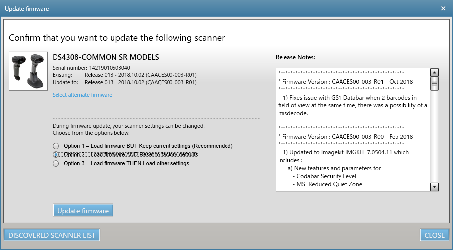
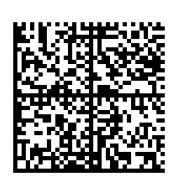
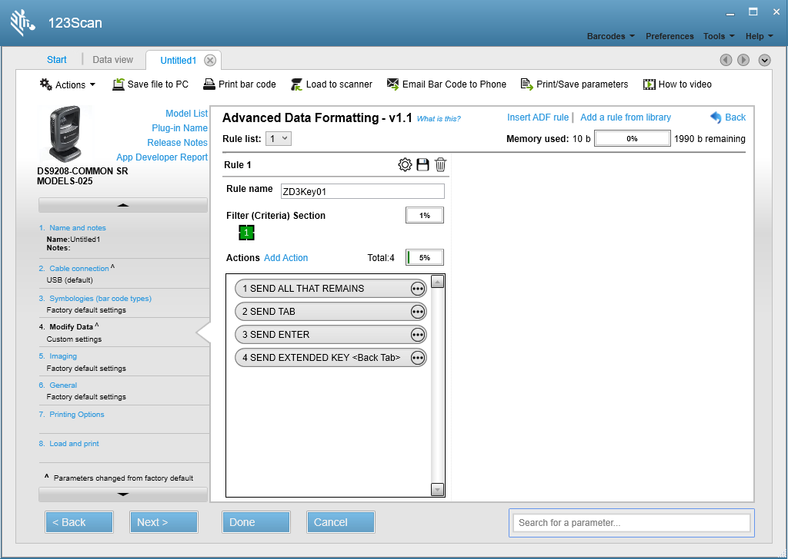
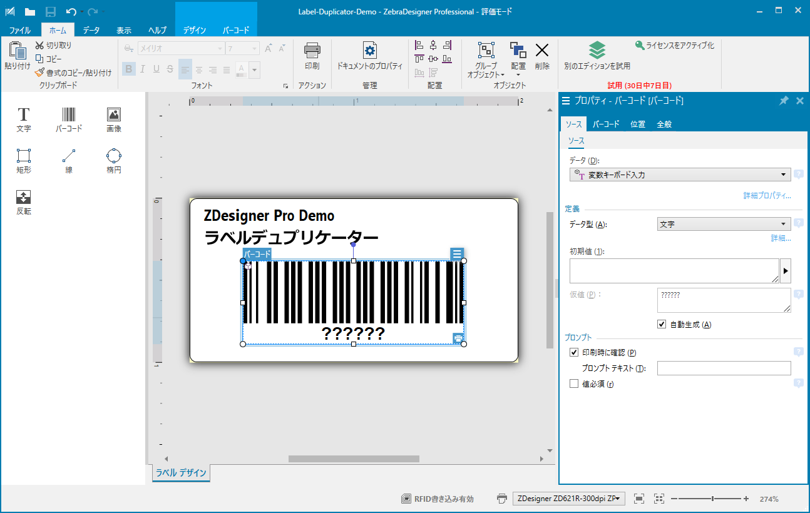
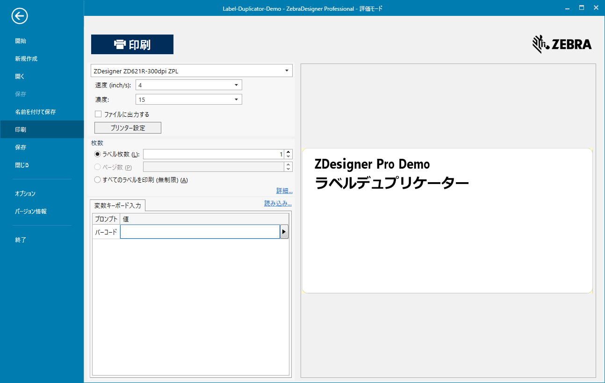
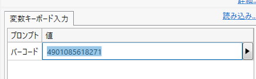
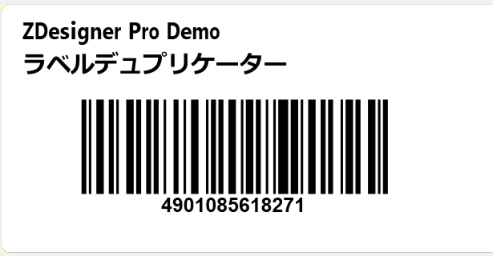

### Zebra-Printer_Scan-Print-From Zebra Designer 3 Pro via DS Scanner
# Zebra DSスキャナ(USB)とZebra Designer 3 Proを連携する方法

スキャンした内容をZebra Designer3で印刷したいという要望があります。要件によって色々な方法がありますが、最も汎用的で、シンプルな方法を説明します。
 

## 0. 本手順で必要なマテリアル
 

1. Zebra Link-OS プリンタ 

1. Zebra DSスキャナ (本頁ではUSBを前提に説明) 

1. 印刷用のラベル・リボン 

1. Window 11 以上のPC 
   - 要: Zebra Designer 3 Professional
   - 要: Zebra 123Scan
  
2. PC <--> プリンタ接続用のUSBケーブル
 

## 1. 123Scan操作：スキャナの設定
 

1. （**重要**）スキャナの初期化

   

 

1. DSスキャナで下記の設定バーコードを読み取り。
   
   

    #### ワンポイント解説

    123Scanでスクラッチから設定をする場合は下記設定内容か、添付の[123Scan設定ファイル](./Config%20File_DS9208_Untitled1_2023.09.23.scncfg)を参考に設定をすること。 
   
 

## 2. Zebra Designer 3 Pro操作：ラベルのフォーマット作成
 

1. 添付の[Label-Duplicator-Demo.nlbl](./Label-Duplicator-Demo.nlbl)を参考にサンプルラベルを作成。
   
   

   #### 例、ラベル複製フォーマット

   |オブジェクト| 設定例|
   |-|-|
   |バーコード| Code128 を**キーボード入力**設定する。|
 

## 3. デモ印刷
 

1. PCにプリンタとスキャナを接続する。 

1. ZDesigner 3を作成したフォーマットで起動する。 

1. **ファイル** → **印刷**を選択し、印刷画面に遷移する。
    

1. **変数キーボード** > **バーコード**が選択された状態にする。 
     
   
    **※（重要）この時、Windows PCの入力が半角英数になっていることを確認すること！！全角入力となっている場合は、半角英数に変更すること。**
     

    

     

2. バーコードを（連続）スキャンし、想定したラベルが印刷されることを確認する。
    

 

## 4. 終わりに

本機能を用いた実用的なデモガイドについては下記を参照すること。

<工事中>